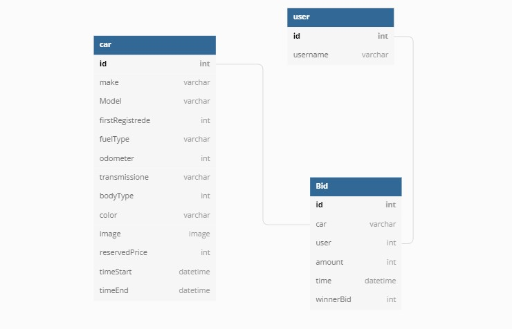
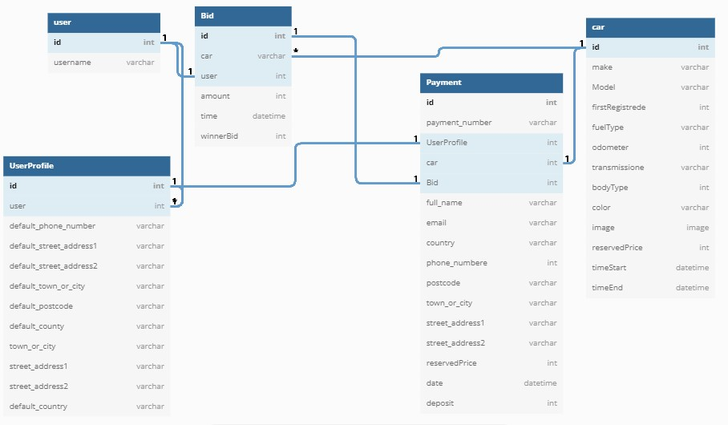

<h1 align="center">Classic Cars Auctions Website</h1>

[View the live project here.](https://classic-cars-auctions.herokuapp.com/)

Classic Cars Auctions is an online auction website specializing in classic cars, offering enthusiasts the opportunity to buy vehicles from across the eras. It is designed to be responsive and accessible on a range of devices, making it easy to navigate for potential customers.

 Home page on diffrent divices<br>
<h2 align="center"></h2><br><br>
 Auctions page on diffrent divices<br>
<h2 align="center"></h2></h2><br><br>
Auction_detail page on diffrent divices<br>
<h2 align="center"></h2></h2><br><br>

## User Experience (UX)

-   ### User stories

    -   #### First Time Visitor Goals

        1. As a First Time Visitor, I want to easily understand the main purpose of the site and learn more about the organisation.
        2. As a First Time Visitor, I want to be able to easily navigate throughout the site to find content.
        3. As a First Time Visitor, I want to locate their social media links to see their followings on social media to determine how trusted and known they are.

    -   #### Returning Visitor Goals

        1. As a Returning Visitor, I want to find information about the auctions.
        2.  As a Returning Visitor, I want to find the best way to contact the organisation with any questions I may have.
        3.As a Returning Visitor, I want to be able to search for cars based on different criteria.

    -   #### Frequent User Goals
    -   ##### As a Customer
        1.  As a Returning Visitor, I want to understand the process I should undergo during the auctions.
        2. As a Frequent User, I want to be able to register and update my details and view the history of my activities on my profile page.
        3. As a Frequent User, I want to be greeted with instant messages and alerts about the activity I do if there when using the website.
        4. As a Frequent User, I want to Know how auctions end, the final prices, and the bidding history for every auction.
        5.  As a Frequent User, I want to receive updates by email about the auctions where I'm bidding.
        6. As a Frequent User, I want to be able to pay the deposit to secure the car once I win the auction.
        7. As a Frequent User, I want to be sure that the payment is secure and that  I won't have any problems with payment.

    -   ##### As a Admin or staff member
        1. As an Admin, I want to have easy access to all the pieces of information I need.

-   ### Design
    -   #### Colour Scheme
        -   The main colours used are WhiteSmoke, light grey bootstrap danger, and info.
    -   #### Typography
        -   The Roboto font is the main font used throughout the whole website with Sans Serif as the fallback font in case for any reason the font isn't being imported into the site correctly. The Lobster is used for the logo throughout the whole website with Sans Serif as the fallback font. 
    -   #### Imagery
        -   The large, background Banner image is designed to be striking and catch the user's attention. 

*   ### Wireframes

    -   Wireframe for small screens - [View](readme_files/wireframes/mobile)
    -   Wireframes for medium and large screens - [View](readme_files/wireframes/descktop)

## Features

-   Responsive on all device sizes

-   Interactive elements

-   User-friendly navigation

-   Product Information

-  Bids

-  Payment

-  Email Confirmation

-  Admin Managment

## Project Structure and Database.
-   ### Home App

    -   ####    Description

    1. The Home App does not have any Database model, and its purpose is to display the Home page containing the banner image welcome section and general information about the process that the user should undergo during an auction. 

-   ### Auction App

    -   ####    Description

        1. Auctions App is the app where all the auction logic happens.
        1. The Auction app allows the user to search for an auction in the database, access the auction, and place a     bid. 
        1. Auction App is responsible for finding the winner's bid, checking if payments were made in time, and finding the payment defaulters.

    -   #### Models
        -   ##### Car Model

            1. represents an auction and contains all car necesserey information.</br></br>
            <h3 align="center"></h3><br><br>

        -    ##### The bid Model 

             1. contains all information about the bid placed by the user and a Boolean field winnerBid, which is set by default to None. Once the auction ends, if the given bid is a winning bid, the field's value is updated to True.
             </br></br>
             <h3 align="center"></h3> </br></br>
    -   #### Models Relationship for Auctions App

        1.  The Car Model is related to the Bid Model by relation OnetoMany as the Bid model takes The car model as ForegineKey. 
        1. The Bid model is related to Allauth User Model by relation OneToOne.
        </br></br>
        <h3 align="center"></h3> </br></br>

-   ### Payment App

    -   ####    Description

        1. The Payment App's role is to accept payments and generate payment confirmations. 
        1. The technology used in the payment app is Stripe. The user can complete the payment by submitting the payment form then the payment is saved in the DB. 
    -   #### Models

        -   #####  Payment Model

        1. The Payment Model contains all needed user information to complete payment.</br></br>
        <h3 align="center"></h3><br><br>

    -   ### Profile App

        -   ####    Description
        1. Profile App's role is t store default user information and allow the user to update detail and display user history.

    -   #### Models
        -   ##### UserProfile Model
        1. The UserProfile Model contains all user detail needed for payment as the Payment Model use the data stored in the UserProfile Model.</br></br>
        <h3 align="center"></h3><br><br>    

-   ### Relationship between Models across all Apps.
    1. Car Model that represents the auction is related to Bid Model. 
    2. The Payment Model is related to the To Car Model Bid Model and UserProfile Model as payment use user info stored in the UserProfile Model for payment.
    3. Allauth User Model is related to Bid Model and UserProfile.<br><br>
    <h3 align="center"></h3><br><br>
        
    

## Technologies Used

### Languages Used

-   [HTML5](https://en.wikipedia.org/wiki/HTML5)
-   [CSS3](https://en.wikipedia.org/wiki/Cascading_Style_Sheets)
-   [Python](https://en.wikipedia.org/wiki/Python_(programming_language))
-   [JavaScript](https://en.wikipedia.org/wiki/JavaScript)

### Frameworks, Libraries & Programs Used

1. [Django 3.2:](https://en.wikipedia.org/wiki/Django_(web_framework))
    - Django was used as the main framework for the development of the websites.
1. [allauth 3.2:](https://django-allauth.readthedocs.io/en/latest/installation.html)
    - Allauth was used for  authentication, registration, and account management.
1. [AWS:](https://django-allauth.readthedocs.io/en/latest/installation.html)
    - Amazon Web Services were used to store data in the cloud for the deployed project in Heroku.
1. [LibreOffice:](https://www.libreoffice.org/)
    - LibreOffice was used to create a schema demonstrating the database and the relationship between the Models shown in app structures and the database section in Readme.
1. [Stripe:](https://stripe.com/ie)
    - Stripe was used for implementing credit card payments.
1. [SQLite:](https://en.wikipedia.org/wiki/SQLite)
    - SQLite that comes with Django out of the box was used as the database engine.
1. [Bootstrap 4.4.1:](https://getbootstrap.com/docs/4.4/getting-started/introduction/)
    - Bootstrap was used to assist with the responsiveness and styling of the website.
1. [Google Fonts:](https://fonts.google.com/)
    - Google fonts were used to import the 'Roboto' and 'Lobster' fonts into the style.css file which is used on all pages throughout the project.
1. [Font Awesome:](https://fontawesome.com/)
    - Font Awesome was used  to add icons for aesthetic and UX purposes.
1. [jQuery:](https://jquery.com/)
    - jQuery was used to make the navbar responsive and also used for the Toasts and Stripe.
1. [Git](https://git-scm.com/)
    - Git was used for version control by utilizing the Gitpod terminal to commit to Git and Push to GitHub.
1. [GitHub:](https://github.com/)
    - GitHub is used to store the projects code after being pushed from Git.
1. [Heroku:](https://www.heroku.com/)
    - Heroku was used to deploy the final project.
1. [Balsamiq:](https://balsamiq.com/)
    - Balsamiq was used to create the wireframes during the design process.
1. [Photos:](https://apps.microsoft.com/store/detail/9WZDNCRFJBH4?hl=en-us&gl=US)
    - Photos was used to resize and trim the images used in the project.
1. [TinyPNG:](https://tinypng.com/)
    - Balsamiq was used compress the images.
1. [APScheduler 3.9.1:](https://pypi.org/project/APScheduler/)
    -  APScheduler was used to schedule functions that find the winner bid and check for payments.
1. [django-countries 7.3.2](https://pypi.org/project/django-countries/)
    - CountryField was used to provides country choices for use with forms.
1. [django_filters 21.1:](https://django-filter.readthedocs.io/en/stable/index.html)
    - django_filters was used to allows users to filter down a queryset based on a Car model’s fields, displaying the    form to let them do this.
1. [django-crispy-forms==1.14.0](https://pypi.org/project/django-crispy-forms/)
    - Crispy foms was used to Styles forms.
1. [bootstrap_datepicker_plus 4.0.0:](https://django-bootstrap-datepicker-plus.readthedocs.io/en/latest/index.html)
    - bootstrap_datepicker_plus was used to create the DateTime picker inside the forms.


## Testing

The W3C Markup Validator and W3C CSS Validator Services were used to validate every page of the project to ensure there were no syntax errors in the project.

-   [W3C Markup Validator](https://validator.w3.org/#validate_by_uri) - [Results](https://github.com/uskawi/classic_cars_auctions/tree/main/readme_files/validated_html)
-   [W3C CSS Validator](https://jigsaw.w3.org/css-validator/#validate_by_input) - [Results](https://github.com/uskawi/classic_cars_auctions/tree/main/readme_files/validated_css)

The JSHint JavaScript Validator was used to validate every file containing JavaScript  of the project to ensure there  were no errors.
-   [JShint JavaScript Validator](https://jshint.com/) - [Results](https://github.com/uskawi/classic_cars_auctions/tree/main/readme_files/validator_js)

The PEP8 online Python  Validator a was used to validate every Python file of the project to ensure there were no  errors.
-   [PEP8 online](http://pep8online.com/) - [Results](https://github.com/uskawi/classic_cars_auctions/tree/main/readme_files/validated_python)

### Testing User Stories from User Experience (UX) Section

-   #### First Time Visitor Goals

    1. As a First Time Visitor, I want to easily understand the main purpose of the site and learn more about the organisation.

        1. Upon entering the site, users are automatically greeted with a clean and easily readable navigation bar to go to the page of their choice. Underneath, there is a Banner Image with Text explaining the website's primary purpose.
        2. The user has two options, to go to the page of their choice or scroll down, which will lead to the same place to learn more about the organisation.

    2. As a First Time Visitor, I want to be able to easily navigate throughout the site to find content.

        1. The site has been designed to be fluid and never entrap the user. At the top of each page, there is a clean navigation bar. Each link describes the page they will end up at clearl
        2. At the bottom of every page, there is a footer containing:
        Navigation links improve the user experience by preventing from scrolling up to back to navigation. 

    3.  As a First Time Visitor, I want to locate their social media links to see their followings on social media to determine how trusted and known they are.

        1. On every page user will find a footer containing Social media links.
        

-   #### Returning Visitor Goals

    1. As a Returning Visitor, I want to find information about the auctions.

        1. In the Navigation, the user can find a link that will redirect him to the auctions page, where he can find information about all auctions on the website. Every auction has a link to the auction detail page, where the user can find more detailed information about the given auction again.

    2. As a Returning Visitor, I want to find the best way to contact the organisation with any questions I may have.

        1. The footer contains links to the organization's Facebook, Twitter, and Instagram pages and the organization's email and phone number.
       
    3. As a Returning Visitor, I want to be able to search for cars based on different criteria.

        1. Once the user land on our website, he can find a link to Auctions on the navigation. By clicking on the link, he will land at a page containing all auctions, and at the top, he can find CarSearch, where he can filter the search results based on different criteria:
            Make, Fuel type, Min Age, Max Age, Min Reserved Price, Max Reserved Price, and based on keyword.

-   #### Frequent User Goals
    -   ##### As a Customer

        1. As a Returning Visitor, I want to understand the process I should undergo during the auctions.

            1. The first place the user will start the search for any informations is the home page, where there is a section dedicated to informing the user about how auctions works on Classic Cars auctions.

        2. As a Frequent User, I want to be able to register and update my details and view the history of my activities on my profile page.

            1. Upon landing on any page of our website, allowing access for unregistered users, the user will find a link to the Signup page on the navigation. By clicking on the link, the user is redirected to the Signup page, and by filling and submitting the form, the user will receive an email with a confirmation link.

            2. Once the user is registered, he can access his profile page by clicking on the profile link on navigation. When landing on the profile page, there is a form to update personal details and a link to reset the password, and the history of all previews activities displayed. 

        3. As a Frequent User, I want to be greeted with instant messages and alerts about the activity I do if there when using the website.
            1. Once the user logs in, he's greeted with a message  "Successfully signed in" and for every action the user takes, a message is displayed until the user logs out.

        4. As a Frequent User, I want to Know how auctions end, the final prices, and the bidding history for every auction.

            1. Registered users can view any car's bidding history and final price on the website on the Auction_detail page devoted to a particular vehicle. Even there are not taking part in the auction.
        
        5. As a Frequent User, I want to receive updates by email about the auctions where I'm bidding.

            1. Every time a bid is placed, the user gets a message if the bid was successful or not. Once the bid is successful, the user receives a confirmation email.
            2. Every time a bid is placed for a car, all of the bidding users for the same car receive an email to inform them.

        6.  As a Frequent User, I want to be able to pay the deposit to secure the car once I win the auction.
            1. Once a user won an auction. He is informed by email. And A Secure Payment link shows up on the Auction_detail page, which he won. Then the user is redirected to the payment page by clicking on the link. Once he completes the payment successfully, he is again redirected to the Payment success page containing payment confirmation. 

        7. As a Frequent User, I want to be sure that the payment is secure and that  I won't have any problems with payment.
            1. The website uses Stripe payment, and it does not keep the card details. If something goes wrong with payment and the due amount was taken from the user's card, the website uses Stripe Webhooks to create the payment in the database. 

    -   ##### As a Admin or staff member
        1. As an Admin, I want to have easy access to all the pieces of information I need.
            1. Once the user is logged in as admin at the navigation, there is a link to the admin page where the admin can view the payment add bids, add, update, and delete auctions.
            2. Admin can update and delete page directly from auction Detail_page.


### Further Testing

-   The Website was tested on Google Chrome, Microsoft Edge and Vivaldi browsers.
-   The website was viewed on a variety of devices such as Desktop, Laptop, iPhone7, iPhone 8 & iPhoneX.
-   A large amount of testing was done to ensure that all pages were linking correctly.
-   Friends and family members were asked to review the site and documentation to point out any bugs and/or user experience issues.

### Known Bugs

-   On some mobile devices, a white line appears between the main header and navbar.

## Problems Encountered During The Development Process

-   The workspace didn't recognize the command " python3 manage.py runserver."  when I did run the command pip3 freeze requirements.txt,  many installed apps were missing. To solve this problem, I copied requiremnt.txt from Github, ran the command pip3 install -r requirements.txt, migrated all data again, and created a superuser.
- During the deployment to Heroku, I accidentally pushed the secret Postgres key to GitHub respiratory **(commit hash: 5195ef10f95d45d6bbb2b30cb33a82701fdd8fde)**. I ran the git revert command to solve this, then pushed the changes. Instead of removing, the secret key I got an extra  commit **(commit hash: 1eb52d80de69417e9845e05acfd2662de32fcc41)**. In the end, I dropped the secret key and created a new one to fix the issue, but the old secret key stayed in the Git repository.

## Deployment

### Heroku 

I had to push everything manually to Heroku during the deployment because automatic pushes from GitHub to Heroku were disabled due to a security breach.

1. Log into Heroku or create a new account and log in.
2. top right-hand corner click "New" and choose the option Create new app. If you are a new user, then "Create new app" button will appear in the middle of the screen.
3. Write the app name - it has to be unique. It cannot be the same as this app.
4. Choose Region 
5. Click "Create App"
6. Go to Resources Tab, Add-ons, search and add Heroku Postgres.
7. Go to Django:
8.  app Install dj_data_base_url and psycopg2-binary then  Freeze requirements.txt
9. In settings.py, add import dj_data_base_url.
10. Then down in the databases setting. Comment out the default configuration. And replace the default database with a call to dj_database_url. Parse And give it the database URL from Heroku, Which you can either get from your config variables in your app settings tab.
11. Run the migrations
12. Create a superuser.
13. Remove the Heroku Database Config and uncomment the original, then commit.
14. Add an if statement in settings.py to define the database URL environment variable if the app runs on Heroku Postgres or sequel light.
15. Install gunicorn and Freeze requirements.txt.
16. Create a Procfile to run gunicorn.
17. Login to Heroku from the terminal.
18. disable collect static by using Heroku config:set disable collect static equals 1.
19. Add the hostname of your Heroku app to allow hosts in settings.py and localhost.
20. Commit and push to Github.
21. Push to Heroku.
22. Add a New secret key as a Gitpod variable and unset disable collect static.
23. Replace the secret key setting with the call to get it from the environment and use an empty string as a default. 
24. Set debug to be True only if there's a variable called development in the environment.
25. Commit and push to git.
26. Push to Heroku.
27. Create AWS Account and s3 bucket **(You can see below how to create an AWS account and bucket)**.
28. Go To heroku Dashbord and click on settings.
29. Go to section "Config Vars" and click button "Reveal Config Vars".
30. Add  Heroku secret key.
32. Add AWS_ACCESS_KEY_ID.
32. Add AWS_SECRET_ACCESS_KEY
33. Add USE_AWS True.
34. STRIPE_PUBLIC_KEY.
35. STRIPE_SECRET_KEY.
36. STRIPE_WH_SECRET.

### AWS Amazon Web Sevices

Deployment of the project required the creation of an AWS account and the creation of a bucket within AWS s3 services to store static files including CSS and images.
-   #### Create an AWS account

    1. Navigate to https://aws.amazon.com/console/.
    2. Click on the orange Button Sign up In to the Console.
    3. Fill in All the required information and confirm your email.
    4. Set payment method And pay  1$ (The AWS state this is not a fee but a payment and identity confirmation method).

-  #### Create a bucket using the s3 console

    1. Before creating a bucket, ensure that you have access to s3 services. It takes up to 24h after completing the registration.
    2. Open the Amazon S3 console at https://console.aws.amazon.com/s3/.
    3. Choose Create bucket.
    4. In Bucket name, enter a DNS-compliant name for your bucket.
    5. Choose the AWS Region where you want the bucket to reside.
    6. Under Object Ownership, enable ACLs and control ownership of objects uploaded in your bucket. Choose ACLs enabled and Bucket owner preferred.
    7. In Bucket settings for Block Public Access, enable Public Access.
    8. Then click on create a bucket.
    9. Go to  properties tab turn on static website hosting.
    10. Go to permissions and paste in a coors configuration.
    11. Go to the bucket policy inside permissions And select the policy generator.
    12. Choose s3 bucket policy.
    13. Allow all principals by using a star.
    14. Choose action get_object.
    15. Copy the ARN And paste it into the ARN box.
    16. Click Add statement. Then generate policy, copy this policy to bucket policy editor, star onto the end of the Resource Key, and save.
    18.  Go to the access control list tab and set the list objects permission for everyone
    19. Go back to the services menu and open Iam.
    20. Click groups, then create a new group.
    21. Click policies and then create policy.
    22. go to the JSON tab and then select import managed policy.
    23. Search for s3 and then import the s3 full access policy.
    24. Get the bucket ARN from the bucket policy page in s3 and pasted twice to Resouces in JSON table and add slash star to the second pasted ARN.
    25. Click review policy and give it a name and a description.
    26. click create policy.
    27. Go to groups, click the group you created, then click attach policy. Search for the policy you just created, select it, and click attach policy.
    28. Go to the users page by clicking users on the left-hand side tab.
    29. Click add user. Then click create a user.
    30. check programmatic access box on Access type and select next.
    31. Click create a user.
    32. Download the CSV file, which contains this user's access key and secret access key.
    33. Go to Django App.
    34. Install boto3 by writing in your terminal pip3 install botot3.
    35. Install django-storages by writing in your terminal pip3 install django-storages.
    36. Add the list of requirements by writing in the terminal "pip3 freeze --local > requirements.txt"
    37. Add storages to install apps in setting.py
    38. Add in settingd.py an if statement  **if USE_AWS in os.environ** to check if there's an environment variable called USE_AWS and inside the if statement:
        1. Define AWS_STORAGE_BUCKET_NAME = Your bucket name.
        2. Define  AWS region by adding **AWS_S3_REGION_NAME = AWS Region where you want the bucket to reside**.
        4. Define  AWS Access Key Id  by adding **AWS_ACCSEES_KEY_ID = os.environ.get(AWS_ACCSEES_KEY_ID)**.
        4. Define  AWS access key  by adding **AWS_ACCSEES_KEY = os.environ.get(AWS_ACCSEES_KEY)**.
    
- ### Connecting strip to Heroku.

    1. Login into Stripe.
    2. Go to the dashboard and click on the developers Button.
    3. On the left-hand side, click on webhooks.
    4. Click add endpoint.
    5. Add endpoint URL.
    6. Click select events.
    7. Select all events. 
    8. Click add Events.
    9. Send a response to your Heroku App to check if Stripe is connected to your Heroku App.


### Forking the GitHub Repository

By forking the GitHub Repository we make a copy of the original repository on our GitHub account to view and/or make changes without affecting the original repository by using the following steps...

1. Log in to GitHub and locate the [GitHub Repository](https://github.com/)
2. At the top of the Repository (not top of page) just above the "Settings" Button on the menu, locate the "Fork" Button.
3. You should now have a copy of the original repository in your GitHub account.

### Making a Local Clone

1. Log in to GitHub and locate the [GitHub Repository](https://github.com/)
2. Under the repository name, click "Clone or download".
3. To clone the repository using HTTPS, under "Clone with HTTPS", copy the link.
4. Open Git Bash
5. Change the current working directory to the location where you want the cloned directory to be made.
6. Type `git clone`, and then paste the URL you copied in Step 3.

```
$ git clone https://github.com/YOUR-USERNAME/YOUR-REPOSITORY
```

7. Press Enter. Your local clone will be created.

```
$ git clone https://github.com/YOUR-USERNAME/YOUR-REPOSITORY
> Cloning into `CI-Clone`...
> remote: Counting objects: 10, done.
> remote: Compressing objects: 100% (8/8), done.
> remove: Total 10 (delta 1), reused 10 (delta 1)
> Unpacking objects: 100% (10/10), done.
```

Click [Here](https://help.github.com/en/github/creating-cloning-and-archiving-repositories/cloning-a-repository#cloning-a-repository-to-github-desktop) to retrieve pictures for some of the buttons and more detailed explanations of the above process.

## Credits

### Code
-   A lot of code implemented in the Project is credited to the Code Institute project Boutique Ado.
-   [CSS-tricks](https://css-tricks.com/snippets/css/css-triangle/): Arrow-up on Toats messages. 
-   [W3schools](https://www.w3schools.com/howto/howto_css_hide_arrow_number.asp): Hide Arrows From Input Number.
-   [Bootstrap4](https://getbootstrap.com/docs/4.4/getting-started/introduction/): Bootstrap Library used throughout the project mainly to make site responsive using the Bootstrap Grid System.

### Content

-   Some of the text content on the home page explaining the process a user should undergo during an auction was taken from  [Classiccarauctions uk](https://www.classiccarauctions.co.uk).
### Media

- Banner Image on home page credited to Roberto Vivancos from Pexel
- Ford Mustang Image on home page credited to by Kelly L from Pexel
- Ford Model A Image on All_auction and Auction_detail page credited to mark degnan L from Pexel
- Red BMW Image on All_auction and Auction_detail page credited to Joshua Köller from Pexel
- Yellow De Tomaso Image on All_auction and Auction_detail pages credited to Nordic Overdrive from Pexel
- Lancia Image on All_auction and Auction_detail pages credited to JNordic Overdrive from Pexel
- Orange Chevrolet Ellcamino on All_auction and Auction_detail pages credited to JNordic Overdrive from Pexel
- Orange Porch Image on All_auction and Auction_detail pages credited to JNordic Overdrive from Pexel
- Dodge Image on All_auction and Auction_detail pages credited to Shukhrat Umarov from Pexel
- Rolls Roys Image on All_auction and Auction_detail pages credited to russel moore from Pexel
- Fiat 500 Image on All_auction and Auction_detail pages credited to Janko Ferenc from Pexel

### Acknowledgements

-   My Mentor Caleb Mbakwe continuous helpful feedback.

-   Tutor support at Code Institute for their support.